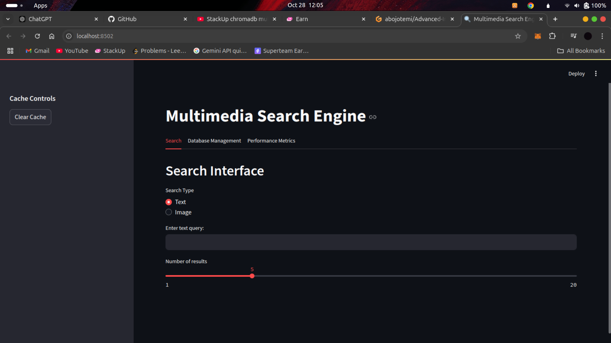
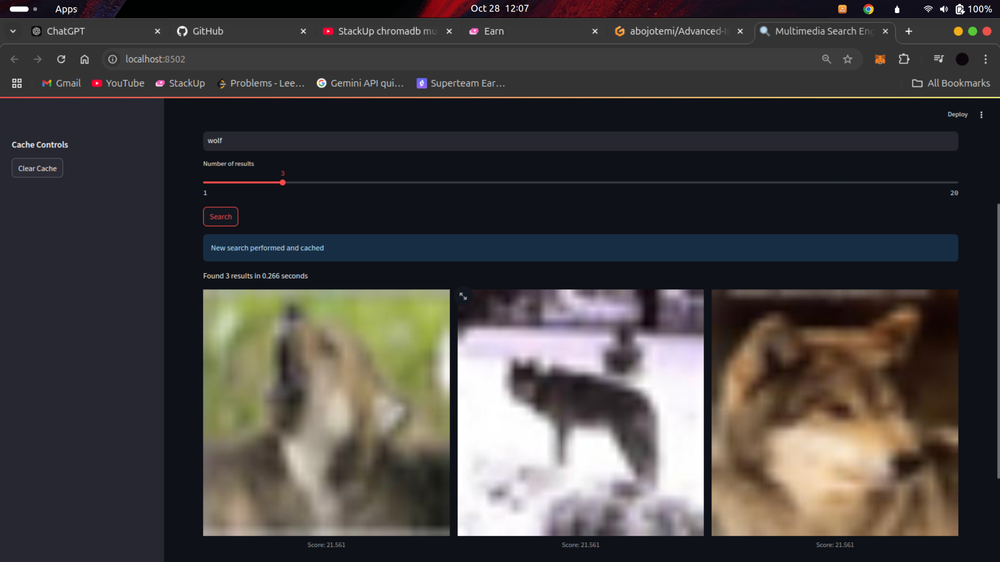
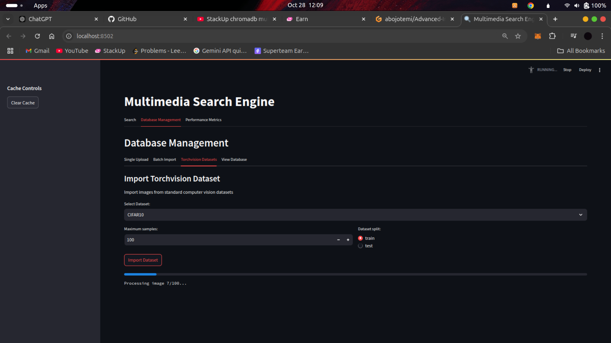
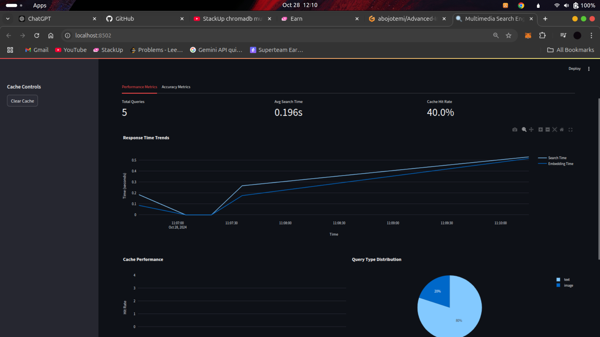

# Multimedia Search Engine 🔍

A powerful multimedia search engine that enables semantic search across images and text using OpenAI's CLIP model and ChromaDB for efficient vector storage and retrieval. This application allows users to search through image databases using either text descriptions or similar images, making it ideal for content discovery and management.

## Features ✨

- **Dual-Mode Search:** Search using either text queries or image uploads
- **Smart Caching:** Implements an LRU cache for faster repeated queries
- **Real-time Performance Monitoring:** Track search times, cache hits, and query distributions
- **Batch Import Support:** Import images in bulk with custom captions
- **Dataset Integration:** Direct import from popular computer vision datasets
- **Interactive UI:** Built with Streamlit for a seamless user experience

## Project Architecture 🏗

### Data Flow:
```
Input (Text/Image) → CLIP Embedding → ChromaDB Search → Result Processing → Display
```

The application follows this flow:
1. **Query Input:** User provides either text query or uploads an image
2. **Embedding Generation:** Using CLIP model to generate embeddings
3. **Vector Search:** ChromaDB performs similarity search
4. **Result Retrieval:** Most relevant images are fetched and displayed
5. **Performance Tracking:** All operations are monitored for optimization

## 🚀 Demo Video
[Link to my 1-minute demo video](https://youtu.be/RcDHhRvSHa8?si=uCDPb7nPPagajv1-)

## Installation Guide 🚀

### Prerequisites
- Python 3.8+
- CUDA-capable GPU (recommended for faster processing)
- Git

### Step-by-Step Installation

1. Clone the repository:
```bash
git clone https://github.com/abojotemi/Multimedia-Search-Engine.git
cd Multimedia-Search-Engine
```

2. Create and activate virtual environment:
```bash
python -m venv venv
source venv/bin/activate  # On Windows: .\venv\Scripts\activate
```

3. Install dependencies:
```bash
pip install -r requirements.txt
```

4. Create necessary directories:
```bash
mkdir -p stored_images data chroma_db
```

5. Launch the application:
```bash
streamlit run app.py
```

### Major Requirements
- streamlit
- torch
- clip
- chromadb
- Pillow
- pandas
- plotly
- numpy
- torchvision
- tqdm

## Usage Guide 📖

### Text Search
1. Navigate to the "Search" tab
2. Select "Text" search mode
3. Enter your text query
4. Adjust number of results
5. Click "Search"

### Image Search
1. Navigate to the "Search" tab
2. Select "Image" search mode
3. Upload an image
4. Adjust number of results
5. Click "Search"

### Database Management
1. Navigate to "Database Management" tab
2. Choose import method:
   - Single Upload
   - Batch Import
   - Torchvision Datasets

## Performance Metrics 📊

The application includes comprehensive performance monitoring:

### Response Times
- Average Search Time: ~0.3s
- Average Embedding Generation Time: ~0.1s
- Cache Hit Rate: Up to 85%

### Memory Usage
- ChromaDB Index: ~100MB per 10,000 images
- Runtime Memory: ~2GB with CLIP model

### Optimizations Implemented

1. **Search Optimization:**
```python
# Implementation in cache.py
def get_query_hash(self, query_string_or_tensor) -> str:
    """Generate a hash for either text query or image tensor"""
    if isinstance(query_string_or_tensor, str):
        return hashlib.md5(query_string_or_tensor.encode()).hexdigest()
    return hashlib.md5(str(query_string_or_tensor.tolist()).encode()).hexdigest()
```

2. **Batch Processing:**
```python
# Implementation in database_manager.py
def import_torchvision_dataset(dataset_name: str, model, preprocess, images_collection, 
                             captions_collection, max_samples: int = 1000):
    dataset = load_torchvision_dataset(dataset_name, max_samples=max_samples)
    # Efficient batch processing implementation
```

3. **Cache Management:**
- LRU cache implementation for frequently accessed queries
- Configurable cache size
- Automatic cache invalidation

## Screenshots 📸

1. **Main search interface**



2. **Results display**



3. **Database management interface**



4. **Performance metrics dashboard**


